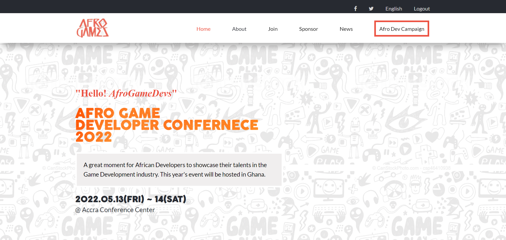

# Afro-gamedev

> This project is a website that is showcase the Annual Afro Game Developer Conference that seeks to gather developers in Africa and beyond for a meet up. This project harnesses the topics I learned from my first week in microverse to date.

[Video Presentation with of the site with Loom](https://www.loom.com/share/1456c388863f46ed87e3dd98525a2a4a)

## Built With

- HTML CSS JS
- Flexbox and CSSGrids
- Linters for HTML, CSS and JS
- All icons were from Font Awesome 4.7

## Live Demo

[Live Demo Link](https://sabetech.github.io/afro-gamedev/)

## Features

- Fully Responsive Site
- Dynamic page section generation with javascript
- Page modification with javascript

## Getting Started

To get a local copy up and running follow these steps.

### Prerequisites

You should have node and npm installed

### Setup

- Clone the project and run npm install to bring in the node modules.
- Remember to gitignore the node_modules folder.

### Run

Run the project with Live server to see the output of the web page.

### Deployment

The website has already been deployed to Github pages. Checkout the [Live Demo Link](https://sabetech.github.io/afro-gamedev/) to preview.

## Authors

👤 **Author**

- GitHub: [@sabetech](https://github.com/sabetech)
- Twitter: [@al_kfx](https://twitter.com/al_kfx)
- LinkedIn: [Albert Mensah-Ansah](https://linkedin.com/in/albertkma)

## 🤝 Contributing

Contributions, issues, and feature requests are welcome!

Feel free to check the [issues page](../../issues/).

## Show your support

Give a ⭐️ if you like this project!

## Acknowledgments

- Thanks to [Cindy Shin in Behance](https://www.behance.net/adagio07) for the design inspiration for this project
